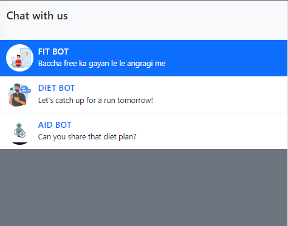

# web1
 
Sure! Below is a template for a structured and visually appealing README guide. This includes sections that will help users and contributors understand and engage with your project. Just fill in the placeholders where necessary! 😊

---

# **Fitness Bot** 🚀  
*Welcome to your ultimate fitness companion! Whether you're looking to start a fitness journey, improve your workout routine, or maintain a healthy lifestyle, this fitness bot is here to guide you every step of the way. With personalized workout plans, nutritional tips, and progress tracking, achieving your fitness goals has never been easier. Let's embark on a journey to a healthier, fitter you—together!*  

---

## **Table of Contents** 📚  
1. [Introduction](#introduction)  
2. [Features](#features)  
3. [Installation](#installation)  
4. [Usage](#usage)  
5. [Contributing](#contributing)  
6. [License](#license)  
7. [Acknowledgements](#acknowledgements)  

---

## **Introduction** 🌟  
**What does this project aim to achieve?**  
*The fitness bot is designed to revolutionize how individuals approach health and wellness by offering a personalized and interactive solution to their fitness needs. It addresses common challenges such as lack of motivation, difficulty in finding tailored workout plans, and confusion about proper nutrition. The bot acts as a virtual fitness coach, providing customized workout routines, diet suggestions, progress tracking, and real-time support
Key Features:


This fitness bot empowers users to take control of their health with convenience, personalization, and expert guidance.  

---

## **Features** ✨  
- 🚀 **Feature 1**: Personalization: Tailored exercise plans and diet recommendations based on user input and goals.  
- 🔒 **Feature 2**: Ease of Use: A user-friendly interface that ensures a seamless experience for fitness enthusiasts of all levels. 
- 🌐 **Feature 3**Unique Selling Points: Encourages consistency by making fitness support accessible anytime, anywhere.
Integrates features like diet plans, medical aid into one cohesive platform.


---

## **Installation** 💻  
**Prerequisites:**  
VS code

**Steps to Install:**  
1. Clone the repository:  
    ```bash  
    git clone https://github.com/username/repository-name.git  
    ```  
2. Navigate to the project directory:  
    ```bash  
    cd repository-name  
    ```  
3. Install dependencies:  
    ```bash  
    npm install  
    ```  
4. Start the project:  
    ```bash  
    npm start  
    ```  

---

## **Usage** 🛠️  
**How do users interact with the project?**  
  

---

## **Acknowledgements** 🙌  
- Thank you to [Prakash choudhary andPiyush Purohit] for [specific contribution].  
- Shoutout to the [Bootstrap] team for their amazing tool.  

---

### **Feedback and Support** 💬  
Have questions or feedback? Feel free to open an issue or reach out via [contact method].  

---

✨ Made with ❤️ by [Nikhil Banthia]  

---

Let me know if you’d like me to add or tweak any section! 😊